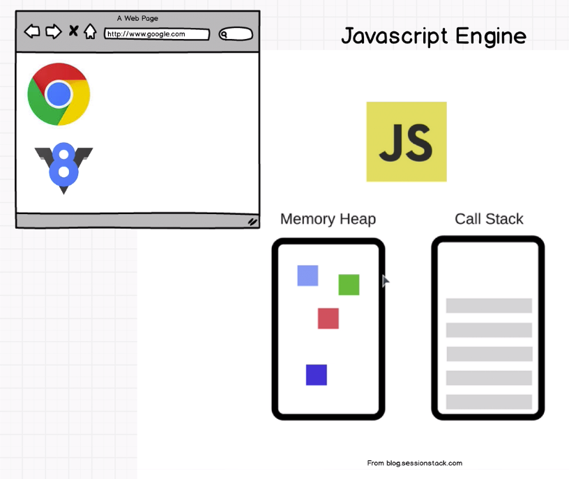
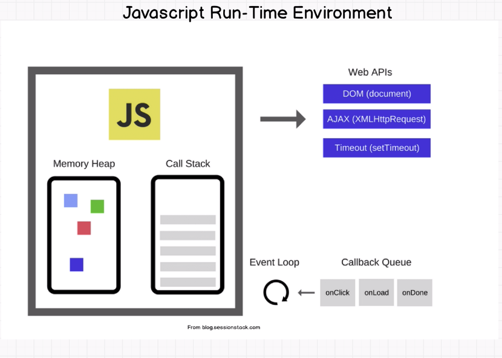

# How JavaScript Works



## Call Stack (aka Execution Stack)

1. Call stack stores functions and variables.

2. It runs in a first in - last out mode.

3. Call stack is where the engine keeps track of where your code is and it's execution.

**Stack Overflow**

In software, a stack overflow occurs if the call stack pointer exceeds the stack bound. The call stack may consist of a limited amount of address space, often determined at the start of the program. The size of the call stack depends on many factors, including the programming language, machine architecture, multi-threading, and amount of available memory. When a program attempts to use more space than is available on the call stack (that is, when it attempts to access memory beyond the call stack's bounds, which is essentially a buffer overflow), the stack is said to overflow, typically resulting in a program crash. [Wikipedia](https://en.wikipedia.org/wiki/Stack_overflow)

## Memory Heap

1. Memory heap is where the memory allocation happens.

2. We use the memory heap to actually point to different variables and objects and data that we store so that we know where to look.

### Memory Leak

Memory leaks happen when you have unused memory just laying around and it fills up this memory heap.

#### Main Reasons for Memory Leak

**Global Variables**

1. If hypothetically I just keep adding variable to my enviroment while we're adding more and more pieces of memory and these where objects and deeply nested objects we can see below the memory being used up more and more and more.

```
var a = 1;
var b = 1;
var c = 1;
```

**Event Listeners**

1. Event listeners is one of the most common ways to leak memory and that is we add these event listeners and then we never remove them when we don't need them.

**setInterval**

1. setInterval where we have the setInterval function that does something and inside of here we satart referencing objects and these objects in here are going to will never be collected by the garbage collector because of this setInterval unless we clear it and stop it is going to keep running and running and running.

# JS Run Time - How JavaScript Works?



1. Javascript is a single threaded language that can be non-blocking.

2. JavaScript runtime has one stack and one heap storage.

3. Stack is LIFO (last in, first out) data storage which store current function execution context of a program.

4. Until a function returns something (while function is executing), it won’t be popped out from the Call Stack. Call Stack will pop entries one by one as soon as that entry (function) returns some value, and it will continue pending function executions.

5. At each entry, state of the stack also called as stack frame. If any function call at given stack frame produces an error, JavaScript will print stack trace which is nothing but a snapshot of code execution at that stack frame.

6. Since JavaScript is single threaded, it has only one stack and one heap. Hence, if any other program want to execute something, it has to wait until previous program is completely executed.

7. Browser comes with a JavaScript engine which provides JavaScript runtime environment.

8. JavaScript runtime actually consist of 2 more components viz. event loop and callback queue. Callback queue is also called as message queue or task queue.

9. Browsers use low level language like C++ to perform these operations and provide clean JavaScript API to work with. These APIs are known as Web APIs.

10. These Web APIs are asynchronous. That means, you can instruct these APIs to do something in background and return data once done, meanwhile we can continue further execution of JavaScript code.

11. While instructing these APIs to do something in background, we have to provide a callback function.

12. So when you call a function, it gets pushed to the stack. If that function contains Web API call, JavaScript will delegate control of it to the Web API with a callback function and move to the next lines until function returns something. Once function hits return statement, that function is popped from the stack and move to the next stack entry.

13. Meanwhile, Web API is doing it’s job in the background and remembers what callback function is associated with that job. Once job is done, Web API binds result of that job to callback function and publishes a message to message queue (AKA callback queue) with that callback. The only job of event loop is to look at callback queue and once there is something pending in callback queue, push that callback to the stack. Event loop pushes one callback function at a time, to the stack, once the stack is empty. Later, stack will execute callback function.
