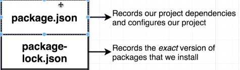

# npm, Webpack, Babel Notes

## npm

How to create a new `package.json` and init npm with a new project?

```javascript
  npm init -y
```

### What is the difference between `package.json` and `package-lock.json` files?

