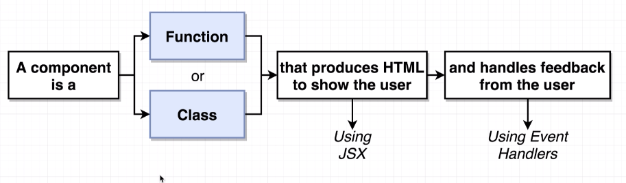
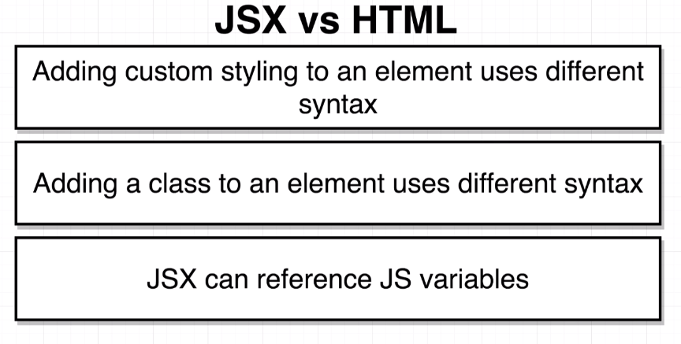
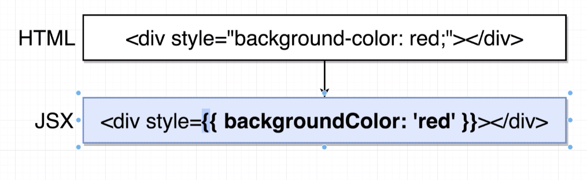

# React CheatSheet

## How to start a React project without Create React App?

**Step 1**

Create a new `package.json` and init npm inside of the project folder

```javascript
  npm init -y
```

**Step 2**

Install `react` and `react-dom` packages from npm.

```javascript
  npm install react react-dom
```

**Step 3**

Create `.gitignore` files to ignore `node_modules` folder while using git.

`.gitignore` file:

```javascript
node_modules
.DS_Store // if you use a Mac
dist // Our production code will be bundles into dist folder so we also don't want dist folder to push our github / git.
```

**Step 4**

Create a folder which will be your main folder for `React` and `components`. In this case, I'm going to create a folder called "App" and will refer it to as "App" folder through the article.

Create `index.js` and `index.css` files under the folder which you just created.

**`index.js`**:

```javascript
var React = require('react');
var ReactDOM = require('react-dom');
require('./index.css');


class App extends React.Component {
  render() {
    return (
      <div>Hello World!~</div>
    )
  }
}

ReactDOM.render(<App />, document.getElementById('app'));
```

**Step 5**

Go to the terminal and run this code under the main folder (not the project folder itself)

```javascript
npm install --save-dev @babel/core @babel/preset-env @babel/preset-react webpack webpack-cli webpack-dev-server babel-loader css-loader style-loader html-webpack-plugin
```

**Step 6**

What `Webpack` does? 

Webpack's main responsibility is that it is a module bundler. An app is generally composed of multiple modules and what Webpack does that takes all of our modules and intelligently combines them into one single file or one single module that you can then reference inside of your `index.html` page 

Create `webpack.config.js` file under the project's root folder.

**`webpack.config.js`**:

```javascript
var path = require('path');

module.exports = {
  entry: './app/index.js',
  output: {
    path: path.resolve(__dirname, 'dist'),
    filename: 'index_bundle.js'
  }
}
```

We are indicating our entry point for Webpack. It is generally the main `App.js` file, in this case we called it `index.js`.

```javascript
entry: './app/index.js',
```

  Webpack will be look up through our entry file and then compose the bundles together and finally will create a bundle js file for production use. We tell the Webpack to where to create this JavaScript file and what it's will be called.

```javascript
path: path.resolve(__dirname, 'dist'),
filename: 'index_bundle.js'
```

What does do `css-loader` and `style-loader` what we do with our second rule?

```javascript
{ test: /\.css$/, use: ['style-loader', 'css-loader'] }
```
What the CSS loader does that it's going to look for any CSS or any time that we use something like that `url('./img/background.png')`, it's going to transform that code into just `require('./img/background.png')` syntax.


What `style-loader` is going to take the CSS that's being required and insert it into the page directly so that the styles are actually active on that page. Like: `require('index.css')`

**Step 7**:

Add `mode` type which can be `development` our `production` in to the Webpack config file.

```javascript
mode: 'development',
```

Our `webpack.config.js` file's final version until this step looks like this:

```javascript
var path = require('path');

module.exports = {
  entry: './app/index.js',
  output: {
    path: path.resolve(__dirname, 'dist'),
    filename: 'index_bundle.js'
  },
  module: {
    rules: [
      { test: /\.(js)$/, use: 'babel-loader' },
      { test: /\.css$/, use: ['style-loader', 'css-loader'] }
    ]
  },
  mode: 'development'
}
```

**Step 8**:

We need to have an `index.html` file which is going to be just main `index.html` file for our entire application.

`Webpack` will be bundles our entire application under the `dist` folder and the main JavaScript file's name will be `index_bundle.js`. So, it also makes sense to have our main `index.html` file to be under the `dist` folder too. One of the our `devDependencies` called `html-webpack-plugin` is going to allow us to automatically generate a `index.html` file which is then going to include a reference to our `index_bundle.js` file.

How do we accomplish that?

First, we are requireing the `html-webpack-plugin` in the top of the our Webpack config file. (`webpack.config.js`)
```javascript
var HtmlWebpackPlugin = require('html-webpack-plugin');
```

Second, add `html-webpack-plugin` and initiate it. Our config file's final looks like this:

```javascript
var path = require('path');
var HtmlWebpackPlugin = require('html-webpack-plugin');
```

```javascript
module.exports = {
  entry: './app/index.js',
  output: {
    path: path.resolve(__dirname, 'dist'),
    filename: 'index_bundle.js'
  },
  module: {
    rules: [
      { test: /\.(js)$/, use: 'babel-loader' },
      { test: /\.css$/, use: ['style-loader', 'css-loader'] }
    ]
  },
  mode: 'development',
  plugins: [
    new HtmlWebpackPlugin({
      template: 'app/index.html'
    })
  ]
}
```

Create a `index.html` under the App folder:

```html
<!DOCTYPE html>
<html lang="en">

<head>
  <meta charset="UTF-8">
  <meta name="viewport" content="width=device-width, initial-scale=1.0">
  <meta http-equiv="X-UA-Compatible" content="ie=edge">
  <title>First React App Without Create React App</title>
</head>

<body>
  <div id="app"></div>
</body>

</html>
```

**Step 9**:

We are looking good until now. We are going the tell `babel-loader` to how we want to compose our JavaScript files.

We will use two dependincies for that. They are `@babel/preset-env` and `@babel/preset-react`. 

`@babel/preset-env` is going to take care of converting our ES6 (and newer) features / syntax to the older browsers. So we can use the syntax and features like `Class`.

`@babel/preset-react` is going to tranform the `JSX` to old school `html`.

We need to add these presets to the babel in the `package.json` file, so:

```javascript
{
  "name": "first-component-without-cra",
  "version": "1.0.0",
  "description": "",
  "main": "index.js",
  "babel": {
    "presets": [
      "@babel/preset-env",
      "@babel/preset-react"
    ]
  },
  .
  .
  .
```
When Webpack bundles all of our modules together our code is going to run through `babel` which is then going to compile it based on the `preset-env` and `preset-react`. So then the bundle that we get from Webpack is going to be just a regular JavaScript that all browsers can understand.

**Step 10**:

Now, we are going to create a command to create our first bundle.

Go to `package.json` and delete the `test` under the `"scripts"` and replace it with this

```javascript
  "scripts": {
    "create": "webpack"
  },
  ```

  Our final version of the `package.json` file should looks like this:

  ```javascript
  {
  "name": "first-component-without-cra",
  "version": "1.0.0",
  "description": "",
  "main": "index.js",
  "babel": {
    "presets": [
      "@babel/preset-env",
      "@babel/preset-react"
    ]
  },
  "scripts": {
    "create": "webpack"
  },
  "keywords": [],
  "author": "",
  "license": "ISC",
  "dependencies": {
    "react": "^16.11.0",
    "react-dom": "^16.11.0"
  },
  "devDependencies": {
    "@babel/core": "^7.6.4",
    "@babel/preset-env": "^7.6.3",
    "@babel/preset-react": "^7.6.3",
    "babel-loader": "^8.0.6",
    "css-loader": "^3.2.0",
    "html-webpack-plugin": "^3.2.0",
    "style-loader": "^1.0.0",
    "webpack": "^4.41.2",
    "webpack-cli": "^3.3.10",
    "webpack-dev-server": "^3.9.0"
  }
}
```

**Step 10**:

Let's add some styling to our App.

Go to `index.css` file and theeen:

```css
body {
  background: green;
}
```
**Step 11**:

Time to magic.

Go to your terminal and run the "npm run create"

Boom!

You did it! Now, you can see the `dist` folder as well as `index_bundle.js`. You can open the `index.html` file in your browser and look at it.

**Step 12**:

We are going to do final touch to the our settings. Right now, our app is not very developer friendly. Because whe we want to run our code, we run `npm run create` command which creates a production bundle for us.

But what if we can run the Webpack live on a localhost and can see the our changes directly in the browser without the hassle everytime with `npm run create`.

We are going to use one of our dependencies for that called `webpack-dev-server`.

Add this to the `scripts` in your `package.json`:

```javascript
"start": "webpack-dev-server --open"
```

Let's go to terminal and run the `npm run start`. Magic happens! You start the Webpack live server on your local and you can do changes and also see it on the browser without any disruption.

`package.json` should look like this:

```javascript
{
  "name": "first-component-without-cra",
  "version": "1.0.0",
  "description": "",
  "main": "index.js",
  "babel": {
    "presets": [
      "@babel/preset-env",
      "@babel/preset-react"
    ]
  },
  "scripts": {
    "create": "webpack",
    "start": "webpack-dev-server --open"
  },
  "keywords": [],
  "author": "",
  "license": "ISC",
  "dependencies": {
    "react": "^16.11.0",
    "react-dom": "^16.11.0"
  },
  "devDependencies": {
    "@babel/core": "^7.6.4",
    "@babel/preset-env": "^7.6.3",
    "@babel/preset-react": "^7.6.3",
    "babel-loader": "^8.0.6",
    "css-loader": "^3.2.0",
    "html-webpack-plugin": "^3.2.0",
    "style-loader": "^1.0.0",
    "webpack": "^4.41.2",
    "webpack-cli": "^3.3.10",
    "webpack-dev-server": "^3.9.0"
  }
}
```

## What is a `React` component?



## `return`

Anytime we have a multi-line `JSX` block and if we want to `return` it, we use parentheses. 

```javascript
const App = () => {
  return(
    <div>
      <p>Yes!</p>
    </div>
  )
}
```

## JSX vs HTLM




**Styling**


First(outer) curly brace indicates that we want to reference a JavaScript variable inside of our JSX.

The second curly brace is meant to indicate a JavaScript object.

**Note**: We are supposed to use double quotes anytime that we want to indicate a string in JSX.

```javascript
<input id="name" type="text" />
```
For any non-JSX property by convention in the JavaScript community traditionally make use of single quotes.
```javascript
<button style={{backgroundColor: 'blue', color: 'white'}}> 
```

At the end of the day there's no difference between them. It is just a style preference.

**class vs className**

```javascript
<label class="label" for="name">Enter name:</label>
```