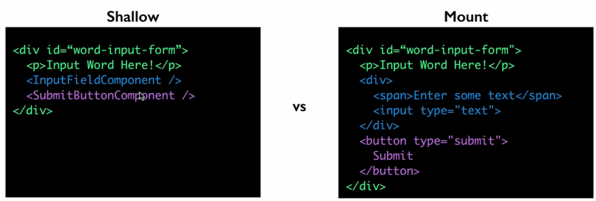

# Types of Tests
**Unit tests**
Tests one piece of code (usually one function)

**Integration tests**
How multiple units work together

**Acceptance / End-to-end (E2E) Tests**
How a user would interact with app

# Testings Goals

**Testing Goal #1`**
-Easy maintenance of tests.
-Test Behavior (what the app should do), not Implementation (how it works). Ideally, do not want to re-write tests after a refactor. Then, if implementation changes, tests remain the same.

**Testing Goal #2`**
-Easy diagnosis of failing tests

**Testing Tradeoffs**
-Granular (unit) testing leads to: Ease of diagnosis, Brittle tests 
-Broader (integration) testing leads to: more robust tests, more difficult to find out waht caused failure

# Enzyme

## What does Enzyme Do?
- Creates virtual DOM for testing
- Allows testing without a browser
- Enzyme uses React's Virtual DOM under the hood
- We can search through DOM with jQuery style selectors
- Simulate simple events (click or blur an element)

## Shallow Rendering
Shallow rendering allows to render components only one level deep.

Render parent, but use placeholders for children.



## Access to props and state
Enzyme provides us access to components' props and state so we can manipulate the props of the state and we can also check to see what they are.

## Common Enzyme Methods

### `debug()`
Returns an HTML-like string of the wrapper for debugging purposes. Useful to print out to the console when tests are not passing when you expect them to.

[.debug([options]) => String](https://airbnb.io/enzyme/docs/api/ShallowWrapper/find.html)

## `find(selector)`
Finds every node in the render tree of the current wrapper that matches the provided selector.

[.find(selector) => ShallowWrapper](https://airbnb.io/enzyme/docs/api/ShallowWrapper/find.html)

## `.state`
Returns the state hash for the root node of the wrapper. Optionally pass in a prop name and it will return just that value.

[.state([key]) => Any](https://airbnb.io/enzyme/docs/api/ShallowWrapper/state.html)

## `.setState`
A method to invoke setState() on the root component instance, similar to how you might in the methods of the component, and re-renders. This method is useful for testing your component in hard-to-achieve states, however should be used sparingly.

[.setState(nextState[, callback]) => Self](https://airbnb.io/enzyme/docs/api/ShallowWrapper/setState.html)

## `.simulate`
Simulate events on the root node in the wrapper. It must be a single-node wrapper.

[.simulate(event[, ...args]) => Self](https://airbnb.io/enzyme/docs/api/ShallowWrapper/simulate.html)

## Installing Enzyme
```javascript
npm install --save-dev enzyme jest-enzyme enzyme-adapter-react-16
```

## Basic Enzyme Setup
```javascript
import React from 'react';

//Import Enzyme
import Enzyme from "enzyme";

//Indicates react version and adapter
import EnzymeAdapter from "enzyme-adapter-react-16";
import App from './App';

//Create an instance of the adapter 
Enzyme.configure({ adapter: new EnzymeAdapter() });

test('renders learn react link', () => {

});
```

## Running all tests
```javascript
yarn test
```
or 
```javascript
npm test
```

## Using `data-$` in only development env
You can also use the built in React `process.env.NODE_ENV` variable to conditionally add attributes depending on build mode, no eject needed.

```javascript
//utils.js
export const testAttr = val => {
  return process.env.NODE_ENV === "production" ? {} : { "data-test": val };
};
 
//App.js
import { testAttr } from './utils.js'
function App() {
  return (
    <div {...testAttr("component-app")} className="App">
      <h1>Hello World</h1>
    </div>
  );
}
```
# Jest

## Installing Jest
```javascript
npm install --save-dev jest
```
Add the following to the `package.json` file:

```javascript
"test": "jest --watch"
```

## Test Files
`Jest` looks for file as ending `.test.js` by default. Like: `App.test.js`.

## Assertion

### Expect 