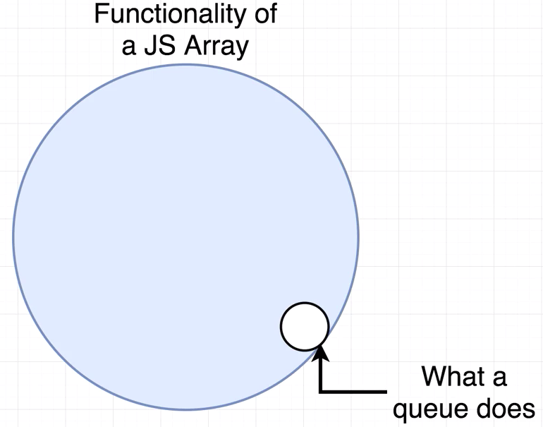
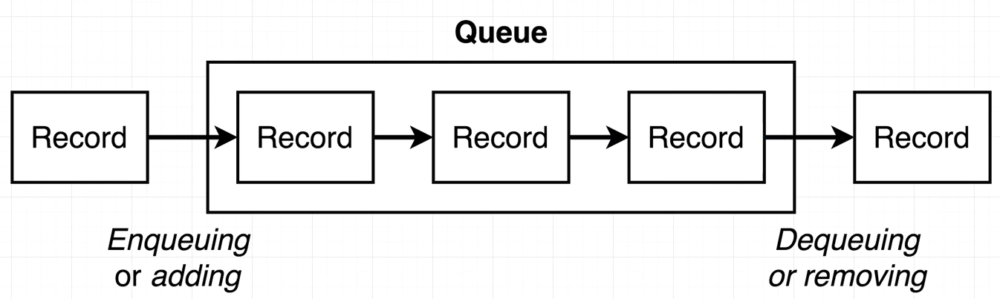
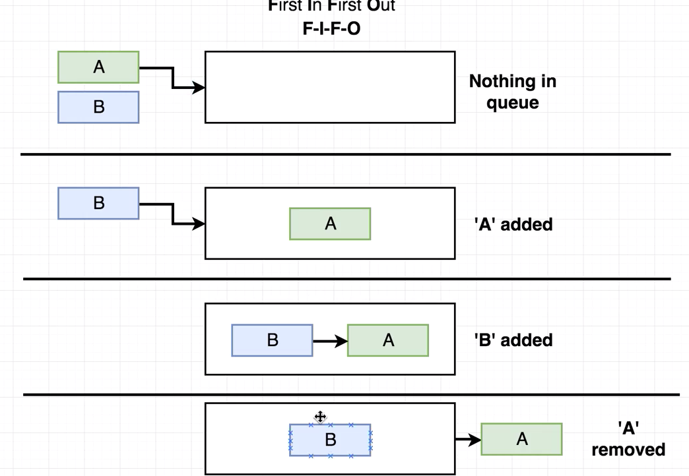
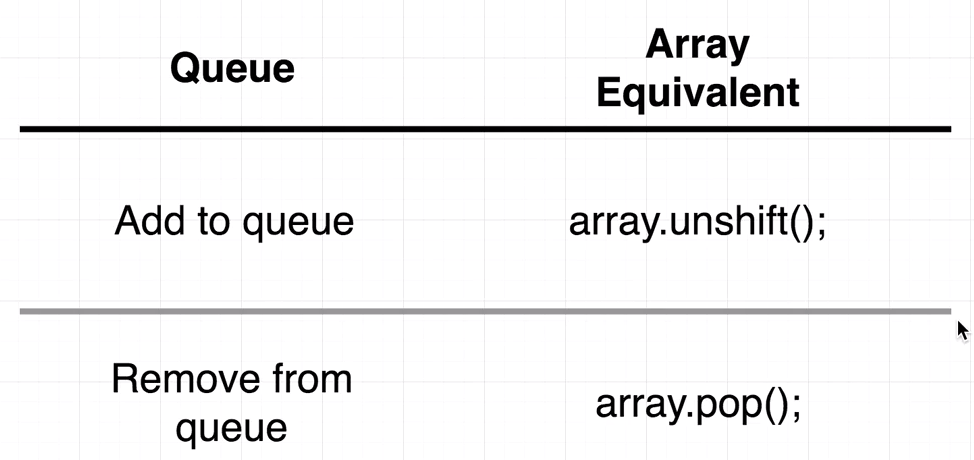

1- We can get any feature of the `queue` by using JavaScript Array. But, we need to clarify while solving some problems that we need `queue` as a data structure in that particular case.

2- We will use JavaScript Array as a base for our `queue` implementation.

3- Adding a new entry to called as `Enqueuing` or simply "adding" and `Dequeuing` or removing.

4. `Queue` works as FIFO - firs in first out principle.

5. We can use JavaScript's `array.unshift()` while adding an entry to queue and `array.pop()` when removing from queue.
