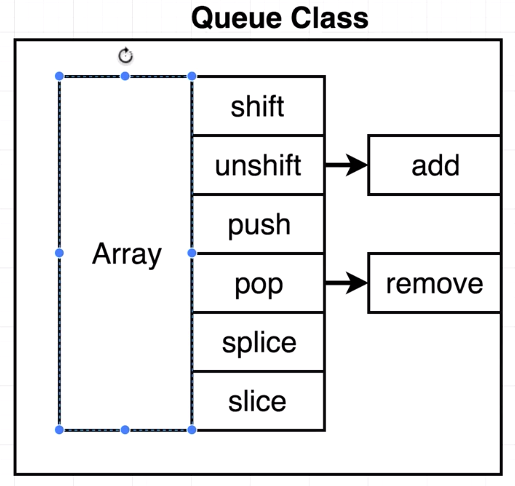

## Queue Implementation



```javascript
class Queue {
  constructor() {
    this.data = [];
  }

  add(item) {
    this.data.unshift(item);
  }

  remove() {
    return this.data.pop();
  }
}

const waitingList = new Queue();
waitingList.add(1);
waitingList.remove();
```
