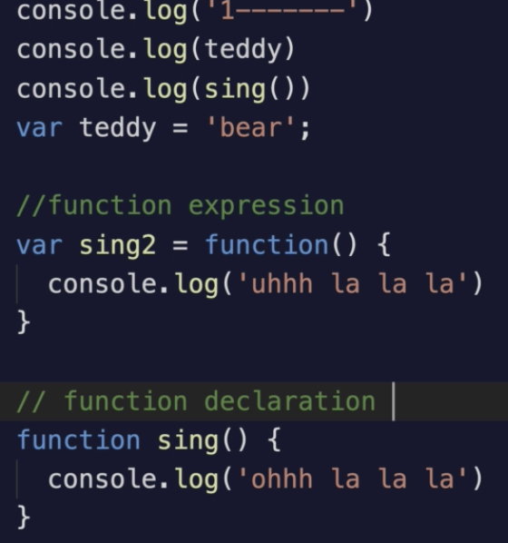
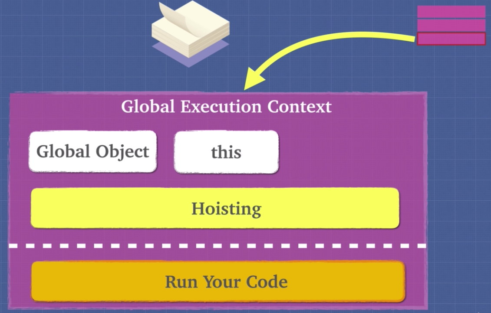

# Hoisting

Hoisting is a JavaScript mechanism where variables and function declarations are moved to the top of their scope before code execution.

Inevitably, this means that no matter where functions and variables are declared, they are moved to the top of their scope regardless of whether their scope is global or local.

Of note however, is the fact that the hoisting mechanism only moves the declaration. The assignments are left in place.

Variables are partially hoisted, the JS hoist the variable but not the right side at first. But functions are fully hoisted.

[Understanding Hoisting in JavaScript](https://scotch.io/tutorials/understanding-hoisting-in-javascript#targetText=Hoisting%20is%20a%20JavaScript%20mechanism,scope%20is%20global%20or%20local.)
