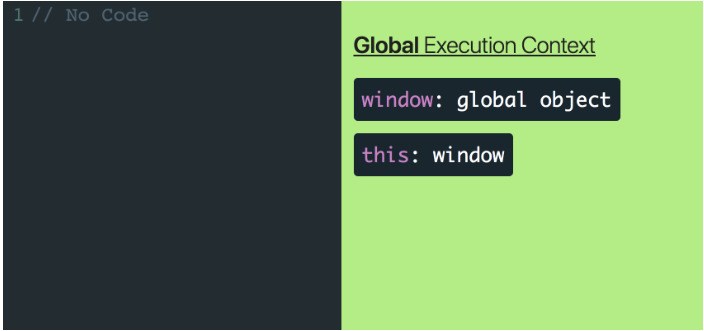
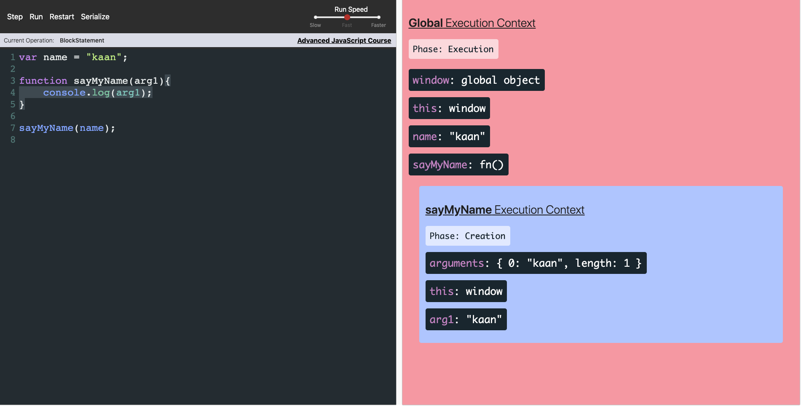
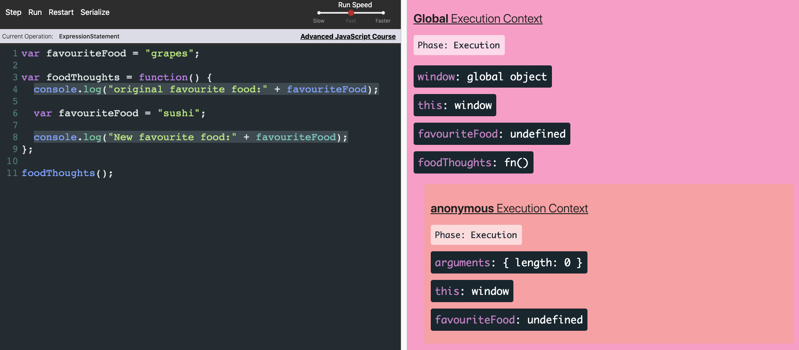
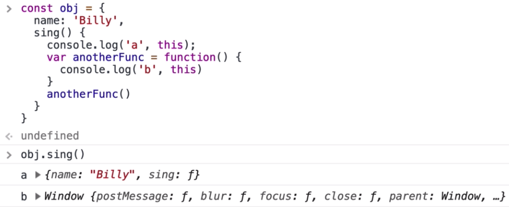
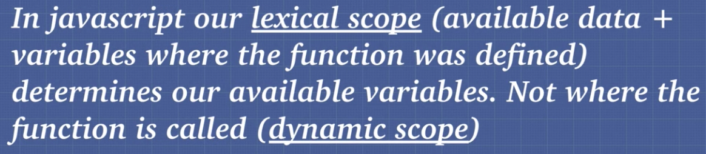

# Summary of Execution Contexts, Hoisting, and Scopes

## Execution Contexts

One strategy for writing software is to break our code up into separate pieces. Though these “pieces” have many different names (functions, modules, packages, etc), they all exist for a single purpose - to break apart and manage the complexity in our applications. Now instead of thinking like someone authoring code, think in terms of the JavaScript engine whose job is to interpret code. Can we use that same strategy, separating code into pieces, to manage the complexity of interpreting code just like we did in order to write it? Turns out we can and these “pieces” are called Execution Contexts. Just like functions/modules/packages allow you to manage the complexity of writing code, Execution Contexts allow the JavaScript engine to manage the complexity of interpreting and running your code.

1. The first Execution Context that gets created when the JavaScript engine runs your code is called the “Global Execution Context”

2. Global Execution Context will consist of two things - a global object and a variable called `this`. `this` will reference the global object which will be `window` object if you’re running JavaScript in the browser or `global` if you’re running it in a Node environment.



3. Execution Context has two separate phases, a "Creation" phase, and an "Execution" phase and each phase has its own unique responsibilities.

During the Creation phase `window` and `this` are created, variable declarations (name and handle) are assigned a default value of `undefined`, and any function declarations (getUser) are placed entirely into memory. Then once we enter the Execution phase, the JavaScript engine starts executing the code line by line and assigns the real values to the variables already living in memory.

- Create a global object.
- Create an object called “this”.
- Set up memory space for variables and functions.
- Assign variable declarations a default value of `undefined` while placing any function declarations in memory.


During the Creation phase `window` and `this` are created, variable declarations (name and handle) are assigned a default value of `undefined`, and any function declarations (getUser) are placed entirely into memory. Then once we enter the Execution phase, the JavaScript engine starts executing the code line by line and assigns the real values to the variables already living in memory.

This process of assigning variable declarations a default value of `undefined` during the creation phase is called `Hoisting`.

Hoisting is the behavior of moving the variables or function declarations to the top of their respective enrionments during the creation phase. Variables are partially hoisted and function declarations are hoisted.

4. Overwrite:

```javascript
var one = 1;
var one = 2;
```

The very last line was to assign. Second (last one) overwrites to first one.

```javascript
a();

function a() {
  console.log("hi");
}

function a() {
  console.log("bye");
}
```

"Bye" one will be assigned to memory. When we invoke the function, the second one(which already overwrite the first one) will run.

## Function Execution Context

1. Function Execution Context created whenever a function is invoked. This is key. The only time an Execution Context is created is when the JavaScript engine first starts interpreting your code (Global Execution Context) and whenever a function is invoked.

2. Whenever a Function Execution Context is created, the JavaScript engine will:

- Create an `arguments` object.
- Create an object called `this`.
- Set up memory space for variables and functions.
- Assign variable declarations a default value of `undefined` while placing any function declarations in memory.


3. When we invoke `getUser` a new Execution Context is created. During the Creation phase of `getUser`'s Execution Context, the JavaScript engine creates a `this` object as well as an `arguments` object. Because `getUser` doesn’t have any variables, the JavaScript engine doesn’t need to set up any memory space or “hoist” any variable declarations.

4. Anytime a function is invoked, a new Execution Context is created and added to the Execution Stack. Whenever a function is finished running through both the Creation and Execution phase, it gets popped off the Execution Stack. Because JavaScript is single threaded (meaning only one task can be executed at a time).

5. There are few important details to notice here. First is that any `argument` we pass in will be added as a `local variable` in that function’s Execution Context. Second, variables declared inside of a function live inside that function’s Execution Context.

Function arguments (parameters) work as local variables inside functions.



6. Function Expression vs Function Decleration:

**Function Expression**\
This function is defined at runtime. When we actually run the function or call the function or execute the function or innoke the function.

```javascript
var canada = () => {
  console.log("cold");
};
```

or

```javascript
var canada = function() {
  console.log("cold");
};
```

**Function Decleration**\
This function gets defined at parse time. That is when the compiler initially looks at the code and starts hoisting and allocating memory.

```javascript
function india() {
  console.log("warm");
}
```

**Function Invocation / Call / Execution**\
canada();\
india();

## Scope

1. Scope means that where variables are accessible.

2. Variables created inside of a function are locally scoped. They can’t be accessed once the function’s Execution Context has been popped off the Execution Stack.

3. if the JavaScript engine can’t find a variable local to the function’s Execution Context, it’ll look to nearest parent Execution Context for that variable. This lookup chain will continue all the way until the engine reaches the Global Execution Context. In that case, if the Global Execution Context doesn’t have the variable, it’ll throw a Reference Error.


4. This process of the JavaScript engine going one by one and checking each individual parent Execution Context if a variable doesn’t exist in the local Execution Context is called the "Scope Chain".

5. Every function creates its own lexical scope:

```javascript
var favouriteFood = "grapes";

var foodThoughts = function() {
  console.log("original favourite food:" + favouriteFood);

  var favouriteFood = "sushi";

  console.log("New favourite food:" + favouriteFood);
};

foodThoughts();
```

This function will output "undefined" and "sushi". It outputs "undefined" at the first line because there is already "favouriteFood" defined as "sushi" and it does not go out to look for the value of "favouriteFood" at Global Context. If we would had not been use the "var" while assigning sushi (just assign it like favouriteFood = 'sushi'), it would have gone to look for it at Global Context (and it would print out "grape").

The code block become this before running:

```javascript
var favouriteFood = undefined;
var foodThoughts = undefined;

foodThoughts = function() {
  var favouriteFood = undefined;
  console.log("original favourite food:" + favouriteFood);

  favouriteFood = "sushi";

  console.log("New favourite food:" + favouriteFood);
};

foodThoughts();
```

This is the visualized version:



6. Scope chain: JavaScript compiler knows what environments are linked to each other and it knows what data can be accessed by which function, Scope chain starts where the variable is defined and goes all the way down to the global context to see if variable exists.

7. Function Scope vs Block Scope:

Javascript is naturally a Function Scope language. It did not have Block Scope until ES6 (let and const).

```javascript
if (5 > 4) {
  var secret = "12345";
}

console.log(secret);
```

We can access 'secret' because the JS does not do Block Scope. But with the ES6 (let and const), we can do Block Scope too. The code blow will throw referenceerror.

```javascript
if (5 > 4) {
  let secret = "12345";
  const supersecret = "manhattanisawesome";
}

console.log(secret);
console.log(supersecret);
```

## Dynamic vs Lexical Scope

1. Lexical means where it is written, scoping is what variable we have access. JavaScript engine before we run any code before we get to line twelve or line thirteen already knows which function has access to which variables because JavaScript is lexically scoped (statically scoped)

2. Everything in JavaScript is actually lexically scoped, how you write it determines what we have available except for the `this` keyword.

3. `this` keyword is not lexically scoped that it does not matter where it is run. It matters how the function was called.





# 'use strict'

1. The purpose of "use strict" is to indicate that the code should be executed in "strict mode".

2. With strict mode, you can not, for example, use undeclared variables.

```javascript
function weird() {
  height = 50;
  return height;
}
```

This function will return "50". Because early version of the JS was allow us to use undeclared variables. It will go to global execution context and create `var height = 50`. But it is a really bad practice and will cause "garbage leakage".

With the `use strict` mode, JS does not allow to use of undeclared variables.

```javascript
"use scrict";
function weird() {
  height = 50;
  return height;
}
```

this function will throw "ReferenceError: height is not defined".

Another JS is Weird example:

```javascript
var heyhey = function doodle() {
  //do something
  doodle();
  return "heyhey";
};

heyhey();
doodle();
```

When we try to invoke the doodle function by using "doodle()", we get reference error(doodle is not define).

This is because the doodle function is actually enclosed in its own scope. doodle gets actually added to its own execution context variable environment.

var heyhey will be defined as "undefined" in the creation phase. It will be invoked during the execution phase. "doodle" is not defined in that case because it will be defined when the actual function is invoked. So, we can only access the doodle in itself.

## Closure

## Sources

- [Advanced JavaScript Concepts](https://www.udemy.com/course/advanced-javascript-concepts/)
- [The Ultimate Guide to Execution Contexts, Hoisting, Scopes, and Closures in JavaScript](https://www.youtube.com/watch?v=Nt-qa_LlUH0)
- [Advanced JavaScript](https://tylermcginnis.com/courses/advanced-javascript/?s=youtube-ultimate-guide-to-hoisting-scopes-closures-in-javascript)
