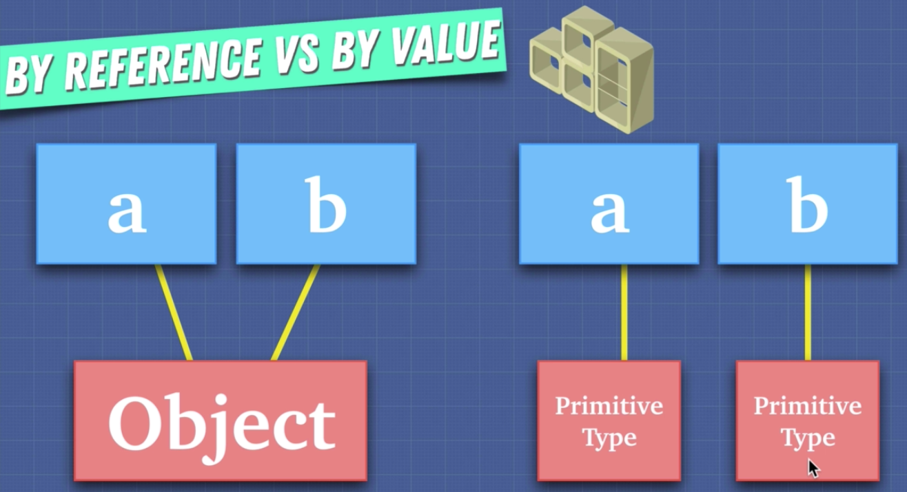

# Types in JavaScrfipt

1. JavaScript types:

- Number (5)
- Boolean (true / false)
- String (Yes!)
- undefined
- null
- Symbol (Symbol('hellu'))
- Object ({})

**Primitive**

- Primitive type directly contains the value of that type.
- Stored on the stack.
- Number (5)
- Boolean (true / false)
- String (Yes!)
- undefined
- null
- Symbol (Symbol('hellu'))

**Reference Data Types (Non-Primitive)**

- Accessed by reference.
- Objects that are stored on the heap.
- A pointer to a location in memory.
- Object ({})
- []
- function(){}

2. We can check the type of any thing with "typeof" operator in JavaScript.

```
typeof 5
typeof true
typeof 'Yes!'
~~
```

**What is the difference between Undefined vs null?**

- Undefined is the adsence of a definition. It's used as the default value when the JavaScript engine initialize is our variables. Undefined simply means that there's a variable there but there's nothing there.

- null is the absence of value. It means there's no value there.

## Array.isArray()

1. To check an variable is actual array or not we can use built in method of Array.isArray()

## Pass By Value vs Pass By Reference

1. Pass By Value: Primitive Types. They don't have a really connection, they just copy/pass the value.

```
var a = 5;
var b = a;

b++;

console.log(a);
console.log(b);
```

In the code above, we copied the value of the "a" to the "b". We don't point a's value to the b, what JS does is only copying the value of a to b. As a result of this, when we do "b++", a's actual value does not change.



2. Pass By Reference:

```
let myObj = {name: 'Kaan', surname:'Caliskan'};
let newObj = myObj;

newObj.surname = 'Civicakan';

console.log(myObj);
console.log(newObj);
```

In the code above, JS pass the reference of the value from "myObj" to the "newObj". It did not "copy" the properties/values of the myObj to the newObj. It simply reference the myObj's values to the newObj. As a result of these, when we change a property's value in the myObj, newObj automatically gets the update.

```
var myPrettyArray = [9,8,7,6,5];
var myNewArray = myPrettyArray;
myNewArray.push(4);
console.log(myNewArray); //[9,8,7,6,5,4];
```

**.concat()**

- JS's built in concat() method clone/copy an existing array's to another array.

```
var myPrettyArray = [9,8,7,6,5];
var myNewArray = [].concat(myPrettyArray);
myNewArray.push(4);
console.log(myNewArray); //[9,8,7,6,5,4];
console.log(myPrettyArray); //[9,8,7,6,5];
```

**Object Cloning / Copying in JavaScript**

1. Shallow cloning: In this cloning type, we can only clone the first layer of the object. (property c and its value another level in this object)

```
let obj = {
  a: 'a',
  b: 'b',
  c: 'c'}
}

let clone = Object.assign({}, obj);
let clone2 = {...obj};

obj.c = '5';
console.log(obj); // {a: 'a', b:'b', c:'5'}}
console.log(clone); // {a: 'a', b:'b', c:'c'}
console.log(clone2); // {a: 'a', b:'b', c:'c'}
```

In the code above, we successfully clone the our main object, obj, to the "clone" and "clone2" object. And when we change the value of the "c" in the original object, which is obj, clone and clone2's did not affect from that change.

```
let obj = {
  a: 'a',
  b: 'b',
  c: {
    deep: 'try to clone me'
  }}
}

let clone = Object.assign({}, obj);
let clone2 = {...obj};

obj.c = 'hahaha';
console.log(obj); // {a: 'a', b:'b', c:{deep: 'hahaha'}}
console.log(clone); // {a: 'a', b:'b', c:{deep: 'hahaha'}}
console.log(clone2); // {a: 'a', b:'b', c:{deep: 'hahaha'}}
```

In the code above, when we change the value of the "c", although we clone it, "clone" and "clone2" values are changed to because of the "shallow" cloning. Object.assign and spread {...obj} only cloning the first level of the object.

2. Deep Object Cloning:

```
let obj = {
  a: 'a',
  b: 'b',
  c: {
    deep: 'try to clone me'
  }}
}

let clone = Object.assign({}, obj);
let clone2 = {...obj};
let superClone = JSON.parse(JSON.stringify(obj));

obj.c = 'hahaha';
console.log(obj); // {a: 'a', b:'b', c:{deep: 'hahaha'}}
console.log(clone); // {a: 'a', b:'b', c:{deep: 'hahaha'}}
console.log(clone2); // {a: 'a', b:'b', c:{deep: 'hahaha'}}
console.log(superClone); // {a: 'a', b:'b', c:{deep: 'try to clone me'}}
```
