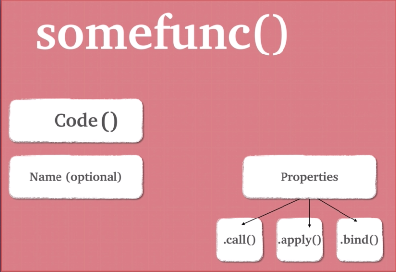

## Functions are Objects

1. Functions are a special type of object called "callable" object. Bracket notation () for the invoking the function, contains the code, it hsa and it also has some properties like call, apply and bind.



2. Functions are first class citizens in JS. Functions can be assigned to variables and properties of objects.

```
var stuff = function(){}
```

3. We can also pass functions as arguments into another function.

```
function a(fn){
  fn()
}

a(function () { console.log('hi there)})
```
