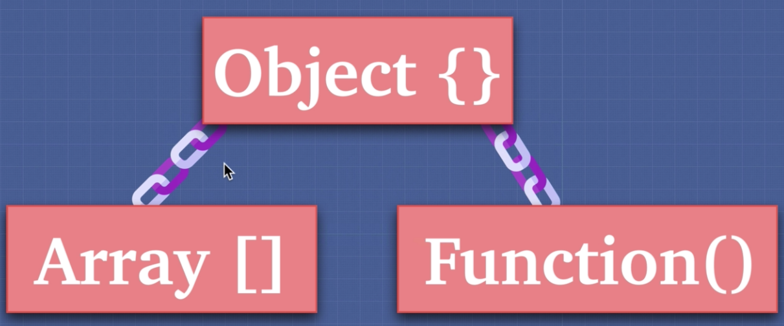
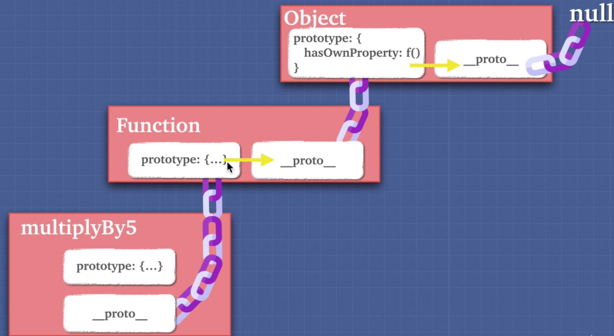
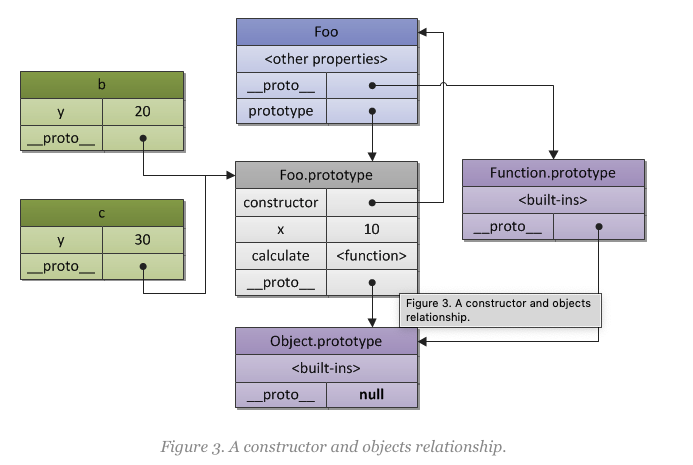

# Prototypal Inheritance



1. Inheritance is an oject getting access to the properties and methods of another object.

2. We can see that prototypal inheritance:

```
const array = []; // We created a new array, this new array was created from a constructor "Array []"

array.__proto__ // we go up the prototype chain and can see the constructor Array

array.__proto__.__proto__ // We get the "base object" in JavaScript. This is the object that everything in javaScript gets created including functions and arrays.


```

2. Object gets access to the properties and methods of another object through the prototype chain.

Example 1 - Creating Prototype Chain:

```
let dragon = {
  name: 'Tanya',
  fire: true,
  fight(){
    return 5
  },
  sing(){
    return `I am ${this.name}, the breather of fire`
  }
}

let lizard = {
name: 'Kiki',
fight(){
  return 1
}
}

lizard.__proto__ = dragon; // We create prototype chain and inherit dragon's all properties and methods.
lizard.sing(); // JS engine first will look up the lizard's properties to find "sing", if it can't find and then it will automatically go look up the dragon's properties.
```

How to check if anything protype of anything ?

```
dragon.isPrototypeof(lizard) // Is dragon prototype of lizard?
```

3. How to check the properties of an object?:

P.S. soruce code is Example 1!

```
for (let prop in lizard){
  console.log(prop);
}

This will return the lizard's properties. But lizard only has two property in reality. How we can check it?


for (let prop in lizard){
  if (lizard.hasOwnProperty(prop)){ //Only log whatever Lizard has as its own property.
    console.log(prop);
  }
}

```

4. Why we should not use `___proto___` ?

It is bad for performance and there's different ways that we want to inherit when it comes to prototype or inheritance. We never want to manually assign the prototype chain and create that chain ourselves. So we never want to manually assign the prototype chain and create that chain ourselves.

We can use `Object.create()` for inheriting.

```
let human = {
  mortal: true
}

let socrates = Object.create(human)
console.log(human.isPrototypeOf(socrates)) // true
```

We created prototype chain by using `let socrates = Object.create(human)`;

5. Why prototypal inheritance is so useful?

The fact that objects can share prototypes means that you can have objects with properties that are pointing to the same place in memory thus being more efficient.

Instead of just copying all functionality into different places / objects, we have it in just one place and then inherits it from just one place.

We're being efficient with our code. We're not repeating ourselves and we're saving ourselves memory.

6. Functions

Functions are callable object.

```

let array = [];

"array.__proto__" => points the Array constructor object.
"array.__proto__.__proto__" => points the "Godfather" object.

---

let obj = {};

"obj.__proto__" points the "Godfather" object.


function A(){

}

"A.prototype" => The prototype property points to the prototype of the object/function itself. It is the constructor function and therefore has a property called "prototype". If an another function generated from it, it's "myFunction.__proto__" will point to the "A.prototype".

"a.__proto__" => points the constructor Function object.
```



7. F.prototype

Only functions have the prototype property.

The only time we really use prototypes is using when we use constructor functions.

**Constructor**

Besides creation of objects by specified pattern, a constructor function does another useful thing — it automatically sets a prototype object for newly created objects. This prototype object is stored in the ConstructorFunction.prototype property.

E.g., we may rewrite previous example with b and c objects using a constructor function. Thus, the role of the object a (a prototype) Foo.prototype plays:

```
// a constructor function
function Foo(y) {
  // which may create objects
  // by specified pattern: they have after
  // creation own "y" property
  this.y = y;
}

// also "Foo.prototype" stores reference
// to the prototype of newly created objects,
// so we may use it to define shared/inherited
// properties or methods, so the same as in
// previous example we have:

// inherited property "x"
Foo.prototype.x = 10;

// and inherited method "calculate"
Foo.prototype.calculate = function (z) {
  return this.x + this.y + z;
};

// now create our "b" and "c"
// objects using "pattern" Foo
var b = new Foo(20);
var c = new Foo(30);

// call the inherited method
b.calculate(30); // 60
c.calculate(40); // 80

// let's show that we reference
// properties we expect

console.log(

  b.__proto__ === Foo.prototype, // true
  c.__proto__ === Foo.prototype, // true

  // also "Foo.prototype" automatically creates
  // a special property "constructor", which is a
  // reference to the constructor function itself;
  // instances "b" and "c" may found it via
  // delegation and use to check their constructor

  b.constructor === Foo, // true
  c.constructor === Foo, // true
  Foo.prototype.constructor === Foo, // true

  b.calculate === b.__proto__.calculate, // true
  b.__proto__.calculate === Foo.prototype.calculate // true

);
```



This figure again shows that every object has a prototype. Constructor function Foo also has its own **proto** which is Function.prototype, and which in turn also references via its **proto** property again to the Object.prototype. Thus, repeat, Foo.prototype is just an explicit property of Foo which refers to the prototype of b and c objects.

**More on [[Prototype]] vs .prototype**

Consider:

```
function MyCustomType (prop1,prop2){
 this.prop = prop1;
 this.anotherProp = prop2;

print:function(){
 return this.prop  +  this.anotherProp;
 }
}

let myInstance = new MyCustomType('hello','world');

console.log(myInstance.print());
```

This way, you are able to define private instance methods and properties.
Nonetheless, if you were to create multiple instances from MyCustomType(), you would find that the print method would be copied over to every single instance .
This is inefficient as its implementation details remain unchanged by external factors;
This is where Function.prototype property comes into play

.prototype is just a regular- and innumerable- property of every function in JS. Its importance only becomes relevant when we invoke a function with a NEW operator.
.prototype references an object that contains all the methods and properties that are shareable across instances of the particular type

Consider:

```
function MyCustomType (prop1,prop2){
 this.prop = prop1;
 this.anotherProp = prop2;
}
MyCustomType.prototype.print = function{

 return this.prop  +  this.anotherProp;

}
let myInstance =  new MyCustomType('hello','world');

console.log(myInstance.print());
```

You may be wondering; how does myInstance have access to the print method ?
this is where `__proto__` or `[[Prototype]]` comes into play !

`[[Prototype]]` or `__proto__` is an internal property of every object that points back to that object's parent prototype.
In other words, that object is LINKED to another object.
This linkage becomes important whenever JS engine must perform a property/ method lookup that does not directly exist on the specific object instance.\*\*

Referring back to our example above, myInstance `__proto__` would get linked to MyCustomType.prototype and all methods / props defined there !

Let say that you create an empty array literal and do this :

```
let myArray=[];
myArray.push(3);
console.log(myArray)
```

Even though the array is empty, you are still able to call the method "push" . That is possible because
It's `__proto__` property points to ARRAY.prototype . This Array.prototype defined all the methods that all array instances are free to use , push,pop, etc...

Javascript has several Built-in types defined :
Function.prototype || Object.prototype || Array.prototype || Number.prototype || Boolean.prototype || String.prototype.

This is indeed hugely debatable and complex topic which will take time to understand.

I would highly recommend reading Kyle Simpson's book series on JavaScript ,specifically "This & Prototype" part.

it's available for free within his github repo .

## Source

- [JavaScript. The Core.](http://dmitrysoshnikov.com/ecmascript/javascript-the-core/#constructor)
- [JavaScript. The Core: 2nd Edition](http://dmitrysoshnikov.com/ecmascript/javascript-the-core-2nd-edition/)
- [F.prototype](https://javascript.info/function-prototype)
- [**proto** VS. prototype in JavaScript](https://stackoverflow.com/questions/9959727/proto-vs-prototype-in-javascript)
