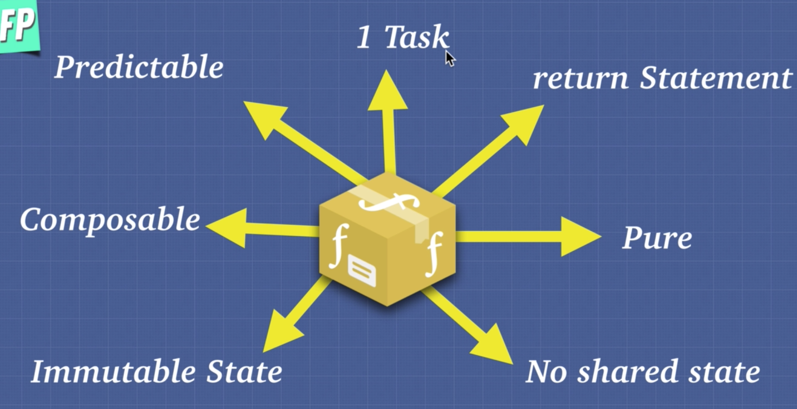

# Functional Programming

The goals of functional programming are the exact same as that of object oriented programming.

- Clear + Understandable
- Eas to Extend
- Memory Efficient
- DRY

If we want to break things doen in functional programming it all comes down to this concep: pure functions.

All objects created in functional programming are immutable. What that means is once something is created it cannot be changed.

## Pure Functions

Pure function has to always return the same output given the same input and the function cannot modify anything outside itself. No side effects.

Not a pure function:

```
//Side effects:
const array = [1,2,3];
function mutateArray(arr) {
  arr.pop()
}
function mutateArray2(arr) {
  arr.forEach(item => arr.push(1
  ))
}
//The order of the function calls will matter.
mutateArray(array)
mutateArray2(array)
array
```

How can we make this code not have any side effects?

```
//no side effects
//input --> output // The input should always result in the same output

const array = [1,2,3];

function removeLastItem(arr){
  const newArray = [].concat(arr);
  newArray.pop();
  return newArray;
}

function multiplyBy2(arr){
  return arr.map(item => item*2);
}

console.log(removeLastItem(array)); // [1,2]
console.log(multiplyBy2(array)); // [2,4,6]
console.log(array); // [1,2,3]
```

`removeLastItem` and `multiplyBy2` are pure functions. We're not modifying anything outside of our scoped world. We're not affecting te outside world and that's the beauty with no side effects.

The code below is a pure function?

```
function a(){
  console.log('hi);
}
```

That's a tricky one. We're using the browser to log something to the browser. So it's actually affecting the otside world. It's logging something to the output of the browser. It's modifying something outside of itself. When we call this while we're outputting something out here so that function has side effects.

Does the function below always return the same output given the same input?

```
function a(num1, num2){
  return num1 + num2
}

a(3,4);
```

If we even run this function many times, the function is always going to return the same thing. This concept is called **Referential Transparency**.

Referential Transparency simply means if I completely change this function to the number seven , will affect any part of my program? (No)

```
function a(num1, num2){
  return num1 + num2;
}

function b(num){
  return num*2;
}

b(a(3,4));
```

Referential transparency says if I change `b(a(3,4));` to `b(7)`, will it have any effect on the program? And not, it doesn't. Because of this rule no matter what my input, if they're the same it's always going to give me the same output and as a matter of fact these functions also have no side effects. They're not touching any of the outside world. They're only touching their own parameters.

The idea with pure functions is that it makes functions very easy to test, very easy to compose and it avoids a lot of bugs because we have not mutations and no shared state. We have these predictable functions that minimize the bugs in our code.

The goal of functional programming is not make everything pure functions. The goal is to minimize side effects.

The core essence of functional programming is very simple. We want to build programs that are built with a bunch of very small, very reusable and predictable pure functions.



**A perfect function:**

- Should do one task and one task only. We don't want a massive function.
- Should have a return statement. Should return something from it. Because when we give it an input, we expect an output.
- Every function should be pure.
- No shared state with other functions and immutable state where we can modify some of the state within our functions but we always return whatever we get such as an input, we always return a new copy of that output. We never just modify our global state.
- Functions are also going to be composable.
- We want to make functions predictable. If we understand with 100 percent certainty what our functions do it makes our code predictable.
