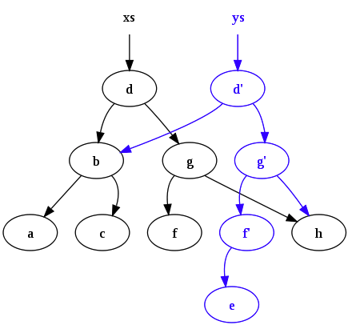

# Functional Programming

The goals of functional programming are the exact same as that of object oriented programming.

- Clear + Understandable
- Eas to Extend
- Memory Efficient
- DRY

If we want to break things doen in functional programming it all comes down to this concep: pure functions.

All objects created in functional programming are immutable. What that means is once something is created it cannot be changed.

## Pure Functions

Pure function has to always return the same output given the same input and the function cannot modify anything outside itself. No side effects.

Not a pure function:

```
//Side effects:
const array = [1,2,3];
function mutateArray(arr) {
  arr.pop()
}
function mutateArray2(arr) {
  arr.forEach(item => arr.push(1
  ))
}
//The order of the function calls will matter.
mutateArray(array)
mutateArray2(array)
array
```

How can we make this code not have any side effects?

```
//no side effects
//input --> output // The input should always result in the same output

const array = [1,2,3];

function removeLastItem(arr){
  const newArray = [].concat(arr);
  newArray.pop();
  return newArray;
}

function multiplyBy2(arr){
  return arr.map(item => item*2);
}

console.log(removeLastItem(array)); // [1,2]
console.log(multiplyBy2(array)); // [2,4,6]
console.log(array); // [1,2,3]
```

`removeLastItem` and `multiplyBy2` are pure functions. We're not modifying anything outside of our scoped world. We're not affecting te outside world and that's the beauty with no side effects.

The code below is a pure function?

```
function a(){
  console.log('hi);
}
```

That's a tricky one. We're using the browser to log something to the browser. So it's actually affecting the otside world. It's logging something to the output of the browser. It's modifying something outside of itself. When we call this while we're outputting something out here so that function has side effects.

Does the function below always return the same output given the same input?

```
function a(num1, num2){
  return num1 + num2
}

a(3,4);
```

If we even run this function many times, the function is always going to return the same thing. This concept is called **Referential Transparency**.

Referential Transparency simply means if I completely change this function to the number seven , will affect any part of my program? (No)

```
function a(num1, num2){
  return num1 + num2;
}

function b(num){
  return num*2;
}

b(a(3,4));
```

Referential transparency says if I change `b(a(3,4));` to `b(7)`, will it have any effect on the program? And not, it doesn't. Because of this rule no matter what my input, if they're the same it's always going to give me the same output and as a matter of fact these functions also have no side effects. They're not touching any of the outside world. They're only touching their own parameters.

The idea with pure functions is that it makes functions very easy to test, very easy to compose and it avoids a lot of bugs because we have not mutations and no shared state. We have these predictable functions that minimize the bugs in our code.

The goal of functional programming is not make everything pure functions. The goal is to minimize side effects.

The core essence of functional programming is very simple. We want to build programs that are built with a bunch of very small, very reusable and predictable pure functions.


**A perfect function:**

- Should do one task and one task only. We don't want a massive function.
- Should have a return statement. Should return something from it. Because when we give it an input, we expect an output.
- Every function should be pure.
- No shared state with other functions and immutable state where we can modify some of the state within our functions but we always return whatever we get such as an input, we always return a new copy of that output. We never just modify our global state.
- Functions are also going to be composable.
- We want to make functions predictable. If we understand with 100 percent certainty what our functions do it makes our code predictable.

## Idempotence

The idea of impotence is a function that always returns or does what we expected to do.

//Not idempotence

```
function notGood(num){
  return Math.random(num);
}

notGood(5);
```

//Idempotence:

```
function notGood(num){
  console.log(num)
}

notGood(5)
```

This function console logs five to the outside world (it is not a pure function) but it is still idempotence because when we run it, it is still going to display the same output.

This idea of being able to call something a thousand times and always giving you the same result is extremely valuable when it comes to things like parallel and distributed computation because it makes our code predictable.

# Imperative vs Declarative

Imperative code is code that tells the machine what to do and how to do it.

Declarative code tells it what to do and what should happen. It does not tell the computer how to do things.


Machine code is very imperative. We say put the variable in this memory space and then take it out here and modify here. It's very descriptive of how to do things versus as we go higher and higher up the chain to something like a higher level language. Well, that becomes more declarative. We don't have to say "hey, this is where you should store the memory." We just declara variable with some sort of data and we say what we need to get done but not how to do it. The computer takes care of that for us.

Imperative vs Declarative Example:

The code below is imperative because we tell to the computer that console.log i and how to to do it like increase the i each time and stopped it when you reach that level.

```
for (let i=0; i < 1000; i++){
  console.log(i);
}

[1,2,3].forEach(item => console.log(item))
```

vs

The code below is more declarative because we tell the computer console log the each item in the array but does not tell to how to do it or when to stop.

```
[1,2,3].forEach(item => console.log(item))
```

It's important to remember that when we talk about declarative and imperative; declarative code is always going to end up either compiling down or being processed by something imperative like machine code.

At the end of the day, we can't just avoid side effects and data manipulation. At the end of the day something has to manipulate the DOM on a web page or talk to a database. But the idea is for us to go a step higher a level into declarative code so that it's easier to read and we can be more productive.

## Immutability

Immutability means not changing the data, not changing the state.

The idea is of immutability that is not changing state but instead making copies of the state and returning a new state everytime.

```
const obj = {name: 'Andrei'}
function clone(obj) {
  return {...obj}; // this is pure
}

function updateName(obj) {
  const obj2 = clone
  (obj);
  obj2.name = 'Nana'
  return obj2
}

const updatedObj = updateName(obj)
console.log(obj, updatedObj)
```

We've maintained immutability of not changing the state with the code above.

This does'nt seem very memory efficient. If we're just copying things over and over every time we want to make a change, doesn't that just fill up our memory.

Functional programming solve this thing that called `Structural Sharing`.

The idea behing the `Structural Sharing` that when a new object or let's say an array or any sort of data structure is created, we don't actually copy everything. If it's a massive object or an array, we can see that being very expensive. Instead of storing the entire copy, underneath the hood what happens is that only the changes that were made to the state will be copied. But the things that don't change in memory are actually still there. And this is called `Structural Sharing`.



This combined with the fact that in this day and age memory is fairly cheap. It makes sense for some cases.

We're simply saying 'Hey! this data is not mine, any data that I receive is not mine. So, I'm just going to borrow it and I'm only going to copy and make a new copy of this data so other people can still use this." It's kind of like kindergarden. If you played with a toy, you shouldn't destroy or change it. You should play with it and then return it back to the school so that other kids can play with it.

# Closure with Functional Programming

```
// HOF
const hof = (fn) => fn(5);
hof(function a(x){return x});

// Closure
const closure = function(){
  let count = 0;
  return function increment(){
    count++
    return count;
  }
}

const incrementFn = closure();
incrementFn();
incrementFn();
incrementFn();
```

This increment function is touching state or data that belongs to another function. When it comes to functional programming, it doesn't mean we can't use closures. we can definitely still use closurer and they're powerful but we have to be careuf that closurer only make a function impure if we modified the closed variable.

```
// Closure
const closure = function(){
  let count = 55;
  return function getCounter(){
    return count;
  }
}

const getCounter = closure();
getCounter();
getCounter();
getCounter();
```

We're using closures here and although we're not modifying the state like we had above, we still have access to data outside of ourselves. But as long as we don't modify it and mutate the data, we're still following the functional programming paradigm.
