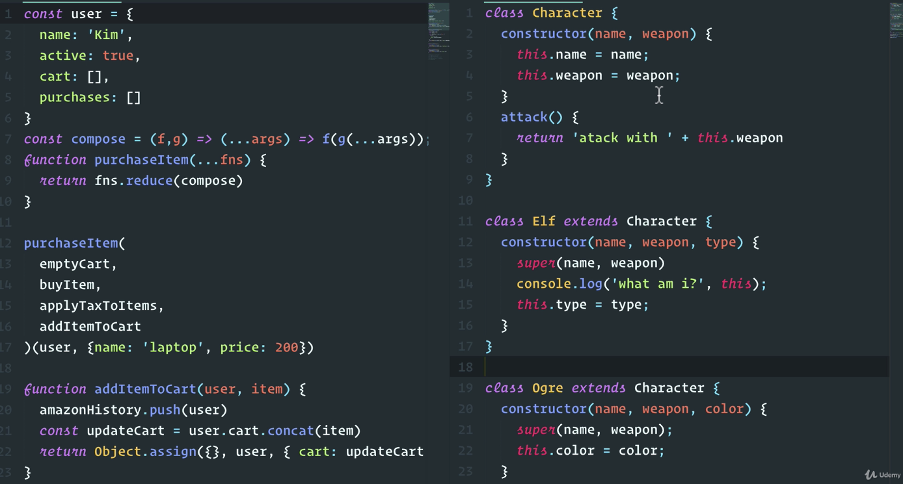
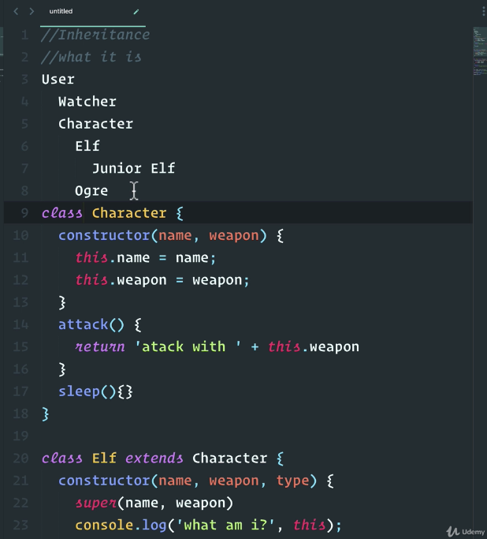
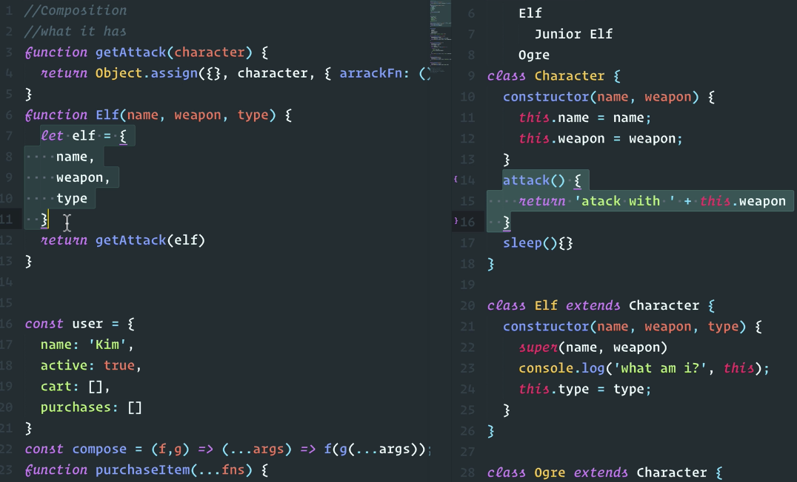

# OOP vs FP

# Composition vs Inheritance

Inheritance is a superclass that is extended to smaller pieces that add or overwrite things. (code at the right side)

Composition is smaller pieces to create something bigger.

**Inheritance**

**1. What it is:** we're structuring our classes around what things are. They have data as well as methods and actions and functions that act upon that data.

But what if things change when we define things as what they are. We are saying that this is what's going to happen but as humans we're notoriusly bad at predicting the future. And we're assuming no change.

Let's play out the scenario, let's say that we now find out that we need to update our game and the character. The character needs to have a sleep method added to it. It seems like not a big deal. Now, all our classes will that extend from character which will have this sleep method.

But there lies a problem called the **tight coupling** problem.

You see the coupling between a child class and its parant is a very tight form of coupling. And what does that mean? Well it's the opposite of reusable modular code because making a small change to a class or even if we change something in the attack method will have these rippling effects to all its subclasses so maybe we made a small change like adding sleep or we made a small change where the attack method does something different down the road maybe the ogre class did something different to attack than now breaks things.

Because some developer changed the parent class and this idea of a tightly coupled inheritance where you can change things in one place and will have rippling effects into the other can be a benefit where you don't you keep your code dry but can also cause a lot of problems so you have all these dependencies where if you change something on a class well you have to make sure that it doesn't break anything with its subclasses. And remember these subclasses are using inheritance and this leads to the other problem.

We have the **tight coupling** problem which leads to the **fragile base class problem**.

With inheritance where because the base class in this case the character class changes all subclasses.

This can be very fragile because of tight coupling.

It can break our code down the path another problem that we might encounter with inheritance is the **hierarchy problem**.

We only have a simple setup here with character and Elf and ogre. But what if we had two different kinds of Elf?.

We had a boss Elf and a junior Elf and the boss Elf or the junior Elf inherits from the boss Elf. The problem with this that this hierarchy is that well what if it changes.

What if the junior elf for some reason in the game is higher up than the hierarchy then the boss elf. It leads to **hierarchy problem**.

Because with inheritance we can start getting into a situation where we design the game with let's say a user in mind then a character in mind that is a subclass and then we have the elf and the ogre but then all of a sudden the game changes or we need to make an update.

So we also add a watcher class and so on and so forth. And the problem starts to arise now where we want to start sharing methods. But let's say that I have the junior Elf class and the junior elf can't really do anything maybe just sleep so we create the junior elf.

But the problem is now that because Junior Elf is inheriting from all these super classes it's going to inherit all the methods that well it doesn't really need and this is the classic gorilla banana problem when it comes to inheritance where it says Hey I just want a banana. Give me a banana but instead you get a gorilla holding a banana and the entire jungle underneath it. In this case the jungle being the user maybe the gorilla being the character and all you wanted was the sleep method

**Composition**

1. What is has (or what it does to data):

We've turned this inheritance model from what the elf is to what the elf does.

We have the base elf but we give the elf abilities through things like `getAttack()` which just uses functions to add to the character object different abilities so that we can compose these small little pieces of functionality to describe our character and the beauty here is that state is not really created internally get attacked simply accepts a state and returns it.

## Summary

1. Inheritance is a superclass that is extended to smaller pieces that add or overwrite things. We should be careful with it and making sure that the base class is very very general so that we don't overload our subclasses. It can easily get out of hand as we go deeper and deeper down the inheritance chain. And once we need to change something it becomes really difficult.

On the other hand with composition it's about smaller pieces that are combined to create something bigger we combined the boxes based on what we need to create our desired output. And if we need to add something later on while we just add another puzzle by composing things together or we add another box and composing things or you can remove them, if you don't need them anymore.
