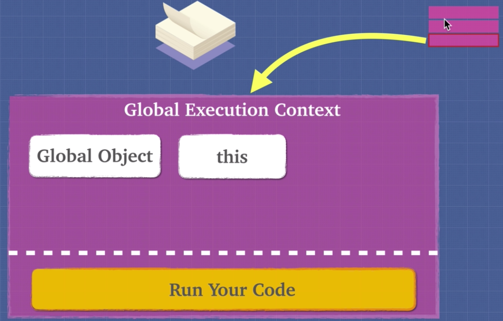

# Lexical Environment and Lexical Scope

**Lexical Scope**\
In JavaScript our lexical scope (available data + variables where the function was defined) determines our available variables. Not where the function is called (dynamic scope).

