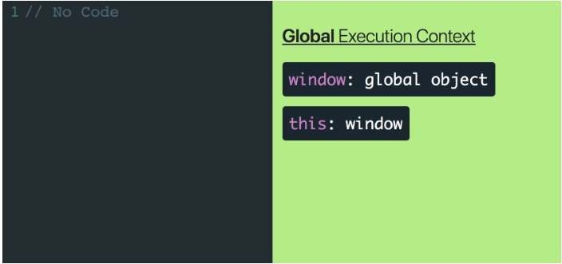

# Summary of Execution Contexts, Hoisting, and Scopes

**Execution Contexts**\
One strategy for writing software is to break our code up into separate pieces. Though these “pieces” have many different names (functions, modules, packages, etc), they all exist for a single purpose - to break apart and manage the complexity in our applications. Now instead of thinking like someone authoring code, think in terms of the JavaScript engine whose job is to interpret code. Can we use that same strategy, separating code into pieces, to manage the complexity of interpreting code just like we did in order to write it? Turns out we can and these “pieces” are called Execution Contexts. Just like functions/modules/packages allow you to manage the complexity of writing code, Execution Contexts allow the JavaScript engine to manage the complexity of interpreting and running your code.

1. The first Execution Context that gets created when the JavaScript engine runs your code is called the “Global Execution Context”

2. Global Execution Context will consist of two things - a global object and a variable called "this". "this" will reference the global object which will be window if you’re running JavaScript in the browser or global if you’re running it in a Node environment.

3. Execution Context has two separate phases, a "Creation" phase, and an "Execution" phase and each phase has its own unique responsibilities.

During the Creation phase window and this are created, variable declarations (name and handle) are assigned a default value of undefined, and any function declarations (getUser) are placed entirely into memory. Then once we enter the Execution phase, the JavaScript engine starts executing the code line by line and assigns the real values to the variables already living in memory.

- Create a global object.
- Create an object called “this”.
- Set up memory space for variables and functions.
- Assign variable declarations a default value of “undefined” while placing any function declarations in memory.

During the Creation phase window and this are created, variable declarations (name and handle) are assigned a default value of undefined, and any function declarations (getUser) are placed entirely into memory. Then once we enter the Execution phase, the JavaScript engine starts executing the code line by line and assigns the real values to the variables already living in memory.

This process of assigning variable declarations a default value of undefined during the creation phase is called "Hoisting".

**Function Execution Context**

1. Function Execution Context created whenever a function is invoked. This is key. The only time an Execution Context is created is when the JavaScript engine first starts interpreting your code (Global Execution Context) and whenever a function is invoked.

2. Whenever a Function Execution Context is created, the JavaScript engine will:

- Create an arguments object.
- Create an object called this.
- Set up memory space for variables and functions.
- Assign variable declarations a default value of “undefined” while placing any function declarations in memory.

3. When we invoke getUser a new Execution Context is created. During the Creation phase of getUsers Execution Context, the JavaScript engine creates a this object as well as an arguments object. Because getUser doesn’t have any variables, the JavaScript engine doesn’t need to set up any memory space or “hoist” any variable declarations.

4. Anytime a function is invoked, a new Execution Context is created and added to the Execution Stack. Whenever a function is finished running through both the Creation and Execution phase, it gets popped off the Execution Stack. Because JavaScript is single threaded (meaning only one task can be executed at a time).

5. There are few important details to notice here. First is that any argument you pass in will be added as a local variable in that function’s Execution Context. Second, variables declared inside of a function live inside that function’s Execution Context.

**Scope**

1. “where variables are accessible.

2. Variables created inside of a function are locally scoped. They can’t be accessed once the function’s Execution Context has been popped off the Execution Stack.

3. if the JavaScript engine can’t find a variable local to the function’s Execution Context, it’ll look to nearest parent Execution Context for that variable. This lookup chain will continue all the way until the engine reaches the Global Execution Context. In that case, if the Global Execution Context doesn’t have the variable, it’ll throw a Reference Error.

4. This process of the JavaScript engine going one by one and checking each individual parent Execution Context if a variable doesn’t exist in the local Execution Context is called the "Scope Chain".

**Closure**

1.
