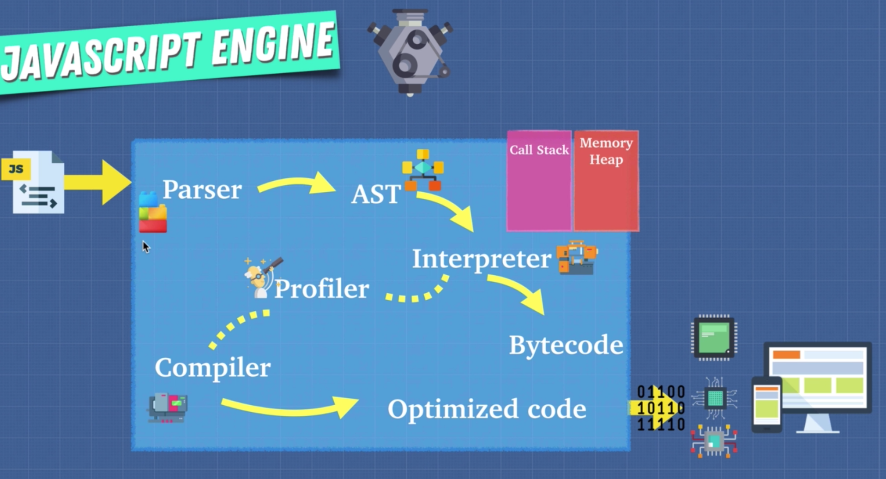

**What is Interpreter?**

**Interpreter**

Interpreter is a computer program that directly executes, i.e. performs, instructions written in a programming or scripting language, without requiring them previously to have been compiled into a machine language program. An interpreter generally uses one of the following strategies for program execution:

1. parse the source code and perform its behavior directly;
2. translate source code into some efficient intermediate representation and immediately execute this;
3. explicitly execute stored precompiled code made by a compiler which is part of the interpreter system.

Interpreter takes code and translate it into line by line to machine code(ByteCode) which will be executed diretly by CPU.

**Compiler**

Compiler tries to understand what we want to do and takes our language and changes it into something else and this usually happens into something called a lower level language such as macine code.

**Interpreter vs Compiler**

1. Compiler obviously takes a little bit longer to get up and running but the code is going to eventually run faster.
2. Interpreter is really fast to get up and running but unfortunately doesn't do any optimizations.

**JIT Compiler**

1. Profiler, also called a monitor, monitors and watches our code as it runs and makes notes on how we can optimize this code such as how many times it is being run. What types are used and how we can possibly optimize this and using this profiler as the code is running through our interpreter which tells our browser what to do if the same lines of code a few times.

2. Using this profiler as the code is running through our interpreter which tells our browser what to do if the same lines of code are run a few times, we actually pass of some of this code to the compiler or a JIT compiler adjust in time compiler because as the code is running the interpreter is going to say "hey here's some code for you to optimize" passes it off to the compiler and the compiler as the application is running takes a code and compiles it or modifies it. So it does what you ask it to but trying to make optimizastions so it runs faster and it then replaces the sctions where it could be improved of the Bytecode with optimized machine code so that optimized code is used from that point on instead of the slower Bytecode.

3. Because the profiler in the compiler are constantly making updates and changes to our Bytecode in order to be as efficient as possible so interpreter allows us to run the code right away. And the compiler and profiler allows us to optimize this code as we're running.
