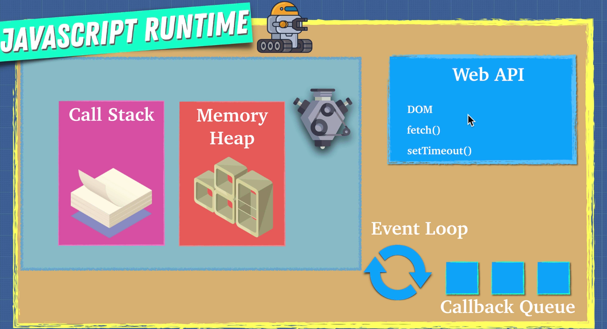

## JavaScript Runtime

1. JavaScript runtime has one stack and one heap storage.

2. Stack is LIFO (last in, first out) data storage which store current function execution context of a program.

3. Until a function returns something (while function is executing), it won’t be popped out from the stack. Stack will pop entries one by one as soon as that entry (function) returns some value, and it will continue pending function executions.

4. At each entry, state of the stack also called as stack frame. If any function call at given stack frame produces an error, JavaScript will print stack trace which is nothing but a snapshot of code execution at that stack frame.

5. Since JavaScript is single threaded, it has only one stack and one heap. Hence, if any other program want to execute something, it has to wait until previous program is completely executed.

6. Browser comes with a JavaScript engine which provides JavaScript runtime environment.

7. JavaScript runtime actually consist of 2 more components viz. event loop and callback queue. Callback queue is also called as message queue or task queue.

8. Browsers use low level language like C++ to perform these operations and provide clean JavaScript API to work with. These APIs are known as Web APIs.

9. These Web APIs are asynchronous. That means, you can instruct these APIs to do something in background and return data once done, meanwhile we can continue further execution of JavaScript code.

10. While instructing these APIs to do something in background, we have to provide a callback function.

11. So when you call a function, it gets pushed to the stack. If that function contains Web API call, JavaScript will delegate control of it to the Web API with a callback function and move to the next lines until function returns something. Once function hits return statement, that function is popped from the stack and move to the next stack entry.

12. Meanwhile, Web API is doing it’s job in the background and remembers what callback function is associated with that job. Once job is done, Web API binds result of that job to callback function and publishes a message to message queue (AKA callback queue) with that callback. The only job of event loop is to look at callback queue and once there is something pending in callback queue, push that callback to the stack. Event loop pushes one callback function at a time, to the stack, once the stack is empty. Later, stack will execute callback function.

**Node Runtime**

